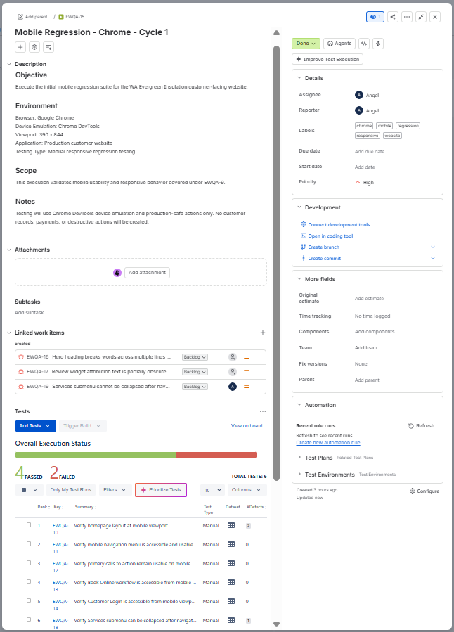
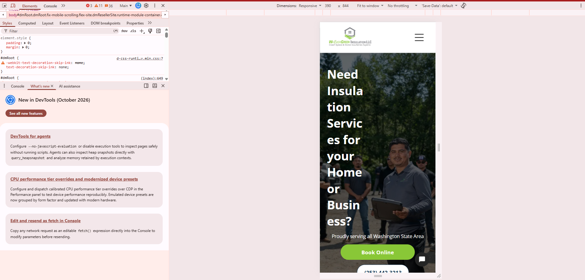
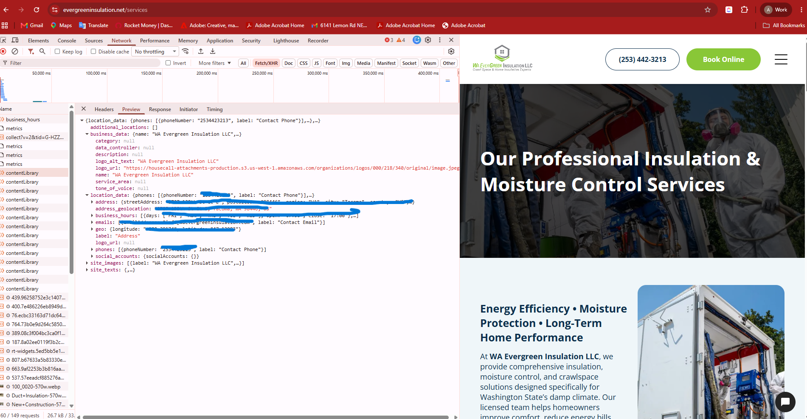
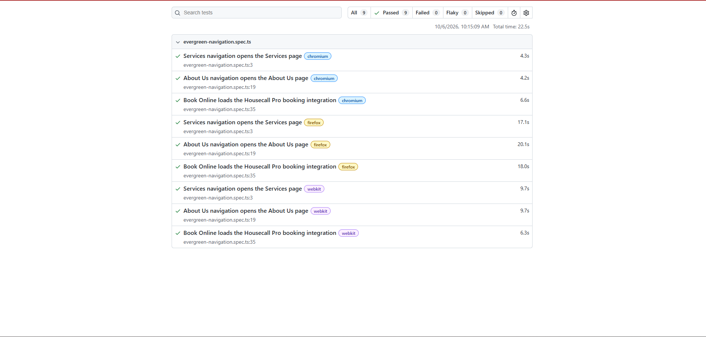
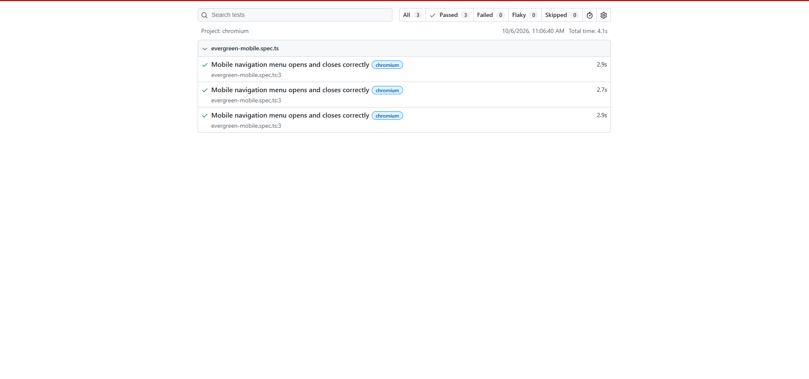
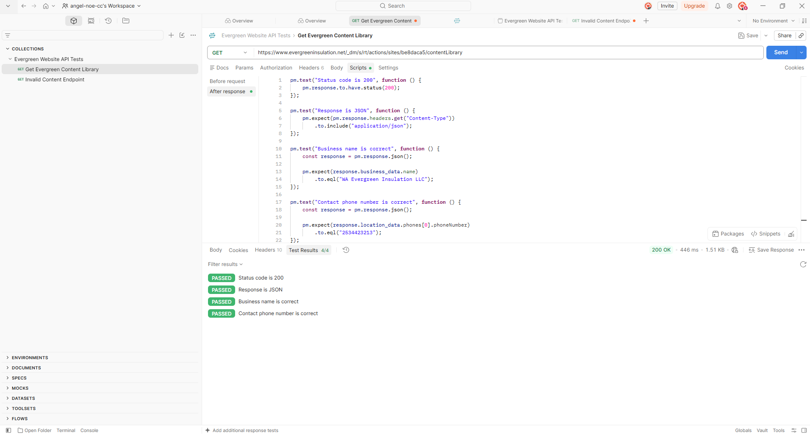
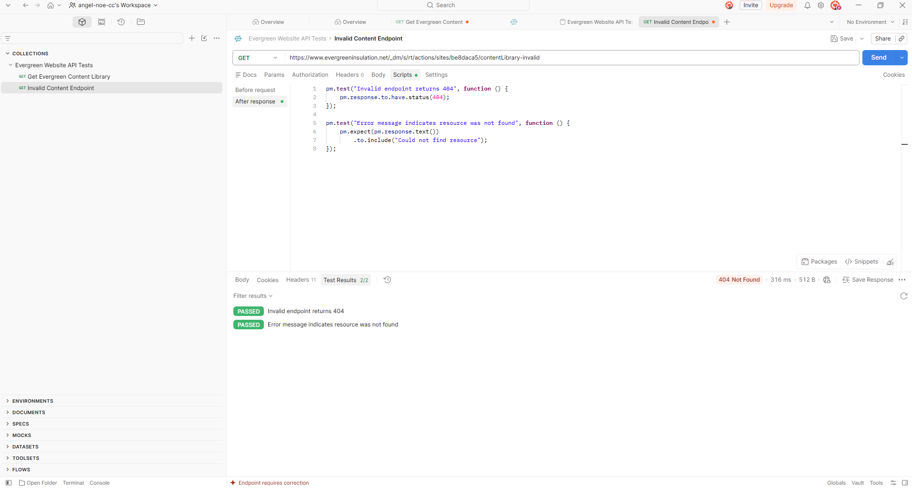

# Evergreen Website QA

Quality assurance testing performed on the public WA Evergreen Insulation LLC website.

I took on this small QA project to evaluate the website from a customer perspective, document reproducible issues, and create testing evidence that could be reviewed internally or shared with the website platform provider when appropriate.

The website uses Housecall Pro services and was tested primarily as a black box application without access to the website source code or production database.

## Project Scope

Testing included:

* Functional testing
* Exploratory testing
* Negative testing
* Mobile and responsive testing
* Cross browser testing
* Regression testing
* Defect reporting
* Chrome DevTools investigation
* Playwright automation
* API testing with Postman

## Tools

**Test Management**

Jira Cloud, Xray Test Management

**Technical Testing**

Chrome DevTools, Playwright, Postman

**Development and Version Control**

TypeScript, Node.js, npm, Visual Studio Code, Git, GitHub

## Manual Testing and Regression

I created and executed manual test cases in Jira and Xray covering the main customer facing areas of the website.

Coverage included Services, About Us, Book Online, Customer Login, mobile navigation, responsive layout, and mobile Services menu behavior.

Regression executions were recorded using PASS, FAIL, and blocked results.

### Regression Test Execution



Additional Jira and Xray evidence is available in the `evidence/jira-xray` folder.

## Defects Identified

Testing identified multiple reproducible mobile issues.

### EWQA 16

The homepage hero heading displayed poor word wrapping and partially hidden text at a 390 x 844 viewport.



### EWQA 17

The review widget attribution was partially obscured on mobile.

### EWQA 19

The Services submenu did not collapse correctly during the tested mobile navigation workflow after navigating to the Services page.

Each defect was documented with reproduction steps and supporting evidence.

Additional defect evidence is available in the `evidence/defects` folder.

## Chrome DevTools Investigation

I used Chrome DevTools to investigate application behavior beyond what was visible in the UI.

This included DOM inspection, computed styles, console investigation, network requests, HTTP responses, responsive testing, and comparison of website information with data returned through network requests.

### UI and Network Data Validation



DevTools helped me investigate whether behavior was limited to the UI or related to network and application behavior without claiming a root cause that had not been confirmed.

## Playwright Automation

I created Playwright tests using TypeScript for selected regression scenarios.

Desktop automation covered:

* Services navigation
* About Us navigation
* Housecall Pro Book Online integration

The suite was executed across Chromium, Firefox, and WebKit.

**Final result: 9 of 9 cross browser executions passed.**

### Cross Browser Regression Results



I also created a separate mobile test using a 390 x 844 viewport.

The test verifies that the mobile navigation button is displayed, the menu opens, the close state appears, and the menu closes successfully.

The mobile test was repeated three times in Chromium to check basic stability.

**Final result: 3 of 3 executions passed.**



## API Testing

I used Postman to test a public website endpoint independently from the frontend.

### Positive API Test

I validated:

* HTTP status 200
* JSON response format
* Correct business name
* Correct public phone number

**4 of 4 assertions passed.**



### Negative API Test

I tested an intentionally invalid endpoint and validated:

* HTTP status 404
* Resource not found response

**2 of 2 assertions passed.**



More API testing details are documented in `docs/api-testing.md`.

## API Workflow

Because this project involved black box testing of the public website, I identified the API endpoint by reviewing network traffic in Chrome DevTools.

In most company environments, QA would typically be given API documentation, Swagger or OpenAPI documentation, developer specifications, or an existing Postman collection. In that case, I would work directly from the documented endpoints and use Chrome DevTools mainly to investigate how the frontend communicates with the API or to troubleshoot issues between the UI and backend services.

## Evidence

The complete evidence set is available in the repository.

```text
evidence/
├── defects/
├── devtools/
├── jira-xray/
├── playwright/
└── postman/
